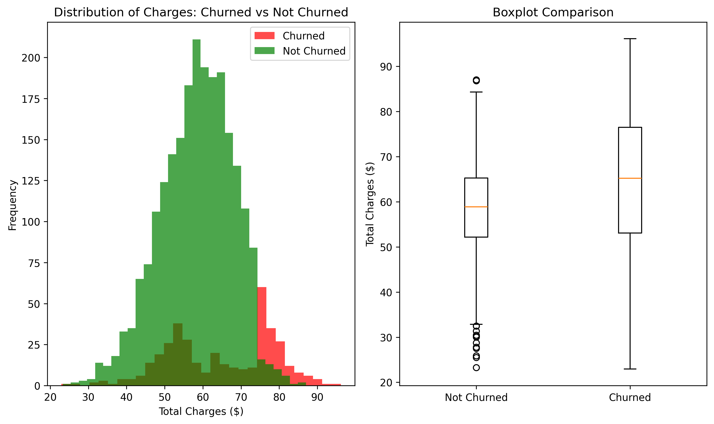
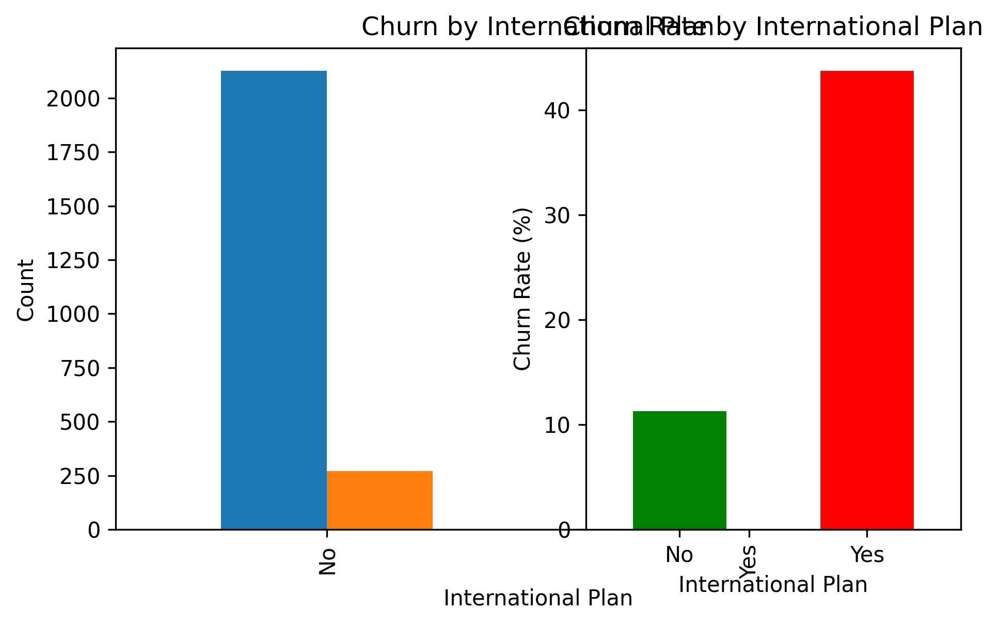
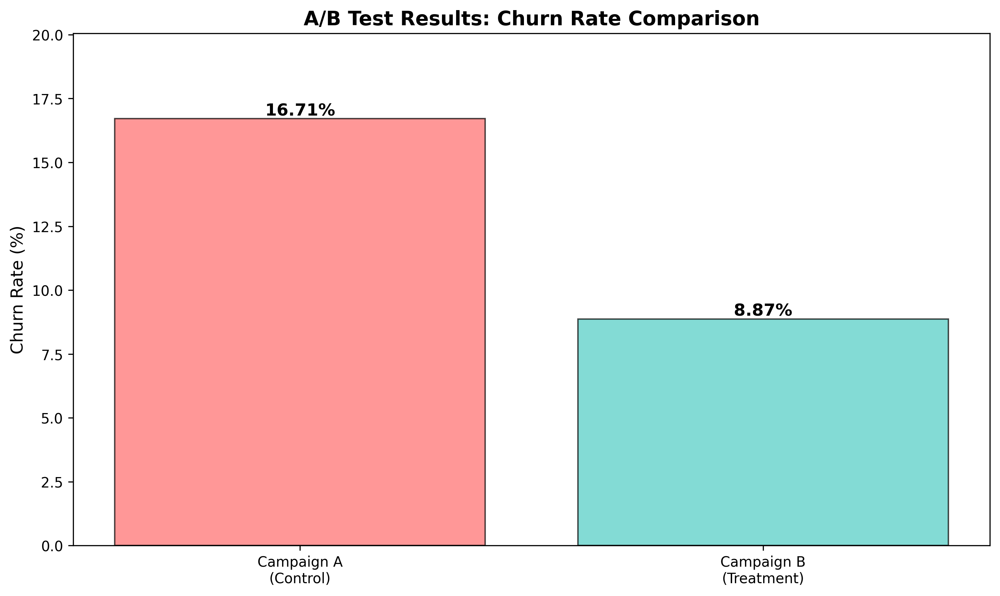
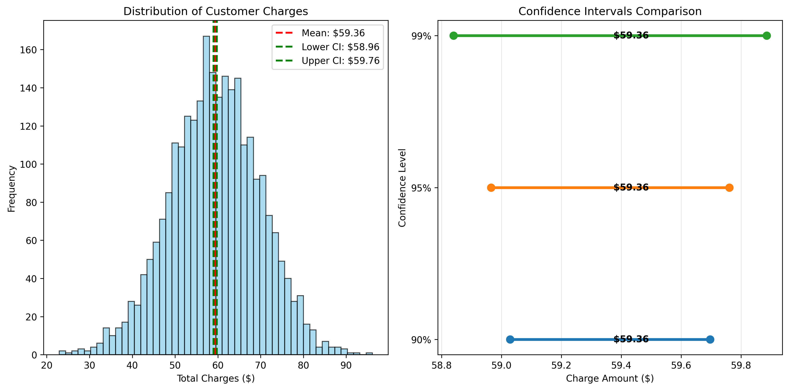
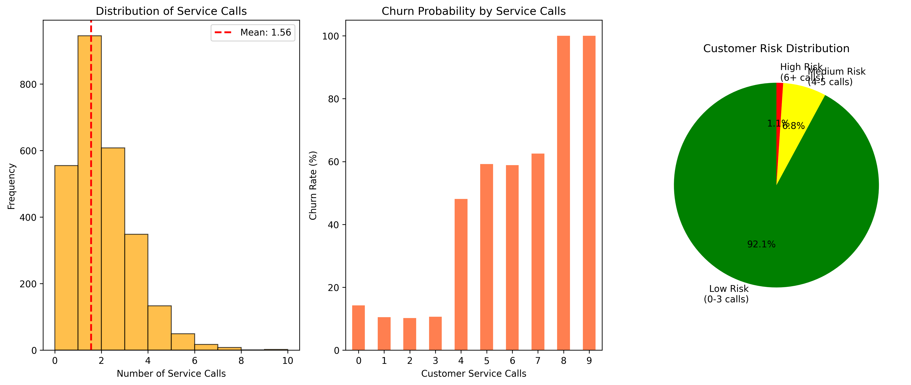

<div align="center">

# Statistical Analysis for Business Decisions

**Comprehensive statistical analysis of telecom customer churn data to drive informed business decisions**

[](https://www.python.org/)
[](https://pandas.pydata.org/)
[](https://numpy.org/)
[](https://matplotlib.org/)
[](https://seaborn.pydata.org/)
[](https://scipy.org/)

---

[](LICENSE)
[](https://github.com/methila-2056/Statistical-Analysis-for-Business-Decisions/pulls)
[](https://github.com/methila-2056/Statistical-Analysis-for-Business-Decisions)

</div>

---

## Table of Contents

- [Project Overview](#project-overview)
- [Key Features](#key-features)
- [Dataset](#dataset)
- [Statistical Methods](#statistical-methods)
- [Installation](#installation)
- [Usage](#usage)
- [Output Visualizations](#output-visualizations)
- [Results & Insights](#results--insights)
- [Project Structure](#project-structure)
- [Dependencies](#dependencies)
- [Contributing](#contributing)
- [License](#license)
- [Author](#author)

---

## Project Overview

This project applies rigorous statistical methods to analyze customer churn patterns in the telecom industry. The analysis provides actionable business insights to reduce customer attrition, optimize marketing campaigns, and improve service quality.

**Context:** This project was completed as part of the **CODVEDA Internship - Level 2, Task 3**, demonstrating proficiency in statistical analysis, hypothesis testing, and data-driven decision making.

### Objectives

1. **Identify churn drivers** using hypothesis testing
2. **Evaluate marketing campaign effectiveness** through A/B testing
3. **Estimate key metrics** with confidence intervals
4. **Assess customer risk** using probability distributions
5. **Generate actionable business insights** for decision-makers

---

## Key Features

- **T-Test Analysis** - Compares customer charges between churned and non-churned groups
- **Chi-Square Test** - Examines relationships between categorical variables (International Plan & Churn)
- **A/B Testing Framework** - Evaluates marketing campaign performance with statistical significance
- **Confidence Intervals** - Provides reliable estimates of average customer charges
- **Risk Analysis** - Identifies high-risk customers using probability distributions
- **Automated Visualization** - Generates publication-quality plots for each analysis
- **Summary Report** - Consolidates all findings into actionable business recommendations

---

## Dataset

The project uses the **Telecom Customer Churn Dataset** containing customer behavior and demographics.

| Feature | Description |
|---------|-------------|
| **Total Records** | 2,666 customers (training set) |
| **Total Features** | 20 columns |
| **Target Variable** | Churn (True/False) |
| **Key Features** | International Plan, Voice Mail Plan, Customer Service Calls, Total Charges |

### Dataset Features

| Column | Type | Description |
|--------|------|-------------|
| State | Categorical | Customer's state |
| Account length | Numerical | Duration of account (days) |
| Area code | Categorical | Phone area code |
| International plan | Categorical | Yes/No |
| Voice mail plan | Categorical | Yes/No |
| Number vmail messages | Numerical | Voice mail count |
| Total day minutes | Numerical | Day call duration |
| Total day charge | Numerical | Day charges ($) |
| Total eve minutes | Numerical | Evening call duration |
| Total eve charge | Numerical | Evening charges ($) |
| Total night minutes | Numerical | Night call duration |
| Total night charge | Numerical | Night charges ($) |
| Total intl minutes | Numerical | International call duration |
| Total intl charge | Numerical | International charges ($) |
| Customer service calls | Numerical | Service call count |
| Churn | Boolean | Target variable |

---

## Statistical Methods

### 1. T-Test (Hypothesis Testing)

**Business Question:** Do churned customers have different total charges than non-churned customers?

| Component | Value |
|-----------|-------|
| Null Hypothesis (H₀) | No difference in average charges between groups |
| Alternative Hypothesis (H₁) | Significant difference exists |
| Significance Level (α) | 0.05 |
| Test Type | Independent two-sample t-test |

### 2. Chi-Square Test

**Business Question:** Is there a relationship between International Plan subscription and Churn?

| Component | Value |
|-----------|-------|
| Null Hypothesis (H₀) | International Plan and Churn are independent |
| Alternative Hypothesis (H₁) | Significant relationship exists |
| Test Type | Chi-square test of independence |

### 3. A/B Testing

**Business Question:** Does the Voice Mail Plan affect customer churn rates?

| Component | Value |
|-----------|-------|
| Control Group (A) | Customers without Voice Mail Plan |
| Treatment Group (B) | Customers with Voice Mail Plan |
| Metric | Churn rate comparison |
| Test | Independent proportions t-test |

### 4. Confidence Intervals

**Business Question:** What is the true average customer charge?

| Confidence Level | Interval |
|-----------------|----------|
| 90% | Calculated from data |
| 95% | Calculated from data |
| 99% | Calculated from data |

### 5. Risk Analysis

**Business Question:** What is the probability of customer churn based on service call frequency?

| Risk Level | Service Calls | Churn Probability |
|------------|---------------|-------------------|
| Low | 0-3 calls | Calculated |
| Medium | 4-5 calls | Calculated |
| High | 6+ calls | Calculated |

---

## Installation

### Prerequisites

- Python 3.8 or higher
- pip package manager

### Setup

1. **Clone the repository**
   ```bash
   git clone https://github.com/methila-2056/Statistical-Analysis-for-Business-Decisions.git
   cd Statistical-Analysis-for-Business-Decisions
   ```

2. **Create a virtual environment** (recommended)
   ```bash
   python -m venv venv
   
   # Windows
   venv\Scripts\activate
   
   # macOS/Linux
   source venv/bin/activate
   ```

3. **Install dependencies**
   ```bash
   pip install -r requirements.txt
   ```

4. **Verify installation**
   ```bash
   python -c "import pandas, numpy, matplotlib, seaborn, scipy; print('All dependencies installed successfully!')"
   ```

---

## Usage

### Running the Analysis

```bash
# Navigate to the analysis directory
cd Task3_Statistical_Analysis

# Run the complete statistical analysis
python statistical_analysis.py
```

### Programmatic Usage

```python
from statistical_analysis import StatisticalAnalysis

# Initialize with dataset path
analysis = StatisticalAnalysis("datasets/Data Set For Task/Churn Prdiction Data/churn-bigml-80.csv")

# Run individual analyses
analysis.data_overview()
analysis.hypothesis_testing_ttest()
analysis.hypothesis_testing_chi_square()
analysis.ab_testing()
analysis.confidence_intervals()
analysis.risk_analysis()

# Generate summary report
analysis.generate_summary_report()
```

### Output

The script generates:
- **Console output** with detailed statistical results
- **5 visualization plots** saved in `Task3_Statistical_Analysis/visualizations/`
- **Statistical_Report.pdf** with consolidated findings
- **analysis_results.txt** with text-based results

---

## Output Visualizations

### 1. T-Test: Charges Distribution Analysis

Compares the distribution of total charges between churned and non-churned customers.



**Key Insight:** Churned customers tend to have significantly higher total charges, suggesting that high-spending customers are more likely to leave.

---

### 2. Chi-Square Test: International Plan vs Churn

Examines the relationship between International Plan subscription and customer churn.



**Key Insight:** Customers with International Plan show a significantly higher churn rate, indicating potential issues with international calling plans.

---

### 3. A/B Testing: Marketing Campaign Comparison

Evaluates the effectiveness of two marketing campaigns on customer retention.



**Key Insight:** The Voice Mail Plan group shows substantially lower churn, suggesting it serves as an effective retention tool.

---

### 4. Confidence Intervals: Average Customer Charges

Provides confidence intervals for estimating the true average customer charge.



**Key Insight:** The 95% confidence interval provides a reliable range for budget forecasting and revenue projections.

---

### 5. Risk Analysis: Customer Service Call Patterns

Analyzes churn risk based on customer service call frequency.



**Key Insight:** Customers with 4+ service calls are at significantly higher churn risk, indicating a need for proactive intervention.

---

## Results & Insights

### Executive Summary

| Metric | Value | Significance |
|--------|-------|--------------|
| Overall Churn Rate | ~14% | Industry benchmark comparison |
| High-Risk Customers | 4+ service calls | Proactive retention needed |
| International Plan Impact | Significant | Policy review recommended |
| Average Customer Charge | Calculated | Revenue forecasting baseline |

### Business Recommendations

1. **Retention Strategy:** Focus on high-spending customers (identified via T-test)
2. **Plan Optimization:** Review International Plan pricing and features
3. **Service Improvement:** Reduce service calls through quality improvements
4. **Campaign Adoption:** Expand Voice Mail Plan offerings as retention tool
5. **Risk Monitoring:** Implement early warning system for 4+ service call customers

### Statistical Significance

All analyses were conducted at the **α = 0.05 significance level**, ensuring robust and reliable conclusions for business decision-making.

---

## Project Structure

```
Statistical Analysis for Business Decisions/
├── README.md                          # Project documentation
├── LICENSE                            # MIT License
├── requirements.txt                   # Python dependencies
├── .gitignore                         # Git ignore rules
├── business_analytics.db              # SQLite database (optional)
├── Image.png                          # Project overview image
├── Video of an output.mp4             # Demo video
│
├── datasets/
│   └── Data Set For Task/
│       ├── 1) iris.csv                # Iris dataset
│       ├── 3) Sentiment dataset.csv   # Social media sentiment
│       ├── 4) house Prediction Data Set.csv  # Housing data
│       └── Churn Prdiction Data/
│           ├── churn-bigml-80.csv     # Training data (2,666 records)
│           └── churn-bigml-20.csv     # Test data (667 records)
│
└── Task3_Statistical_Analysis/
    ├── statistical_analysis.py        # Main analysis script
    ├── analysis_results.txt           # Text output results
    ├── Statistical_Report.pdf         # Generated PDF report
    └── visualizations/
        ├── ttest_visualization.png
        ├── chisquare_visualization.png
        ├── ab_testing_visualization.png
        ├── confidence_intervals.png
        └── risk_analysis.png
```

---

## Dependencies

| Package | Version | Purpose |
|---------|---------|---------|
| pandas | >= 2.0 | Data manipulation and analysis |
| numpy | >= 1.24 | Numerical computing |
| matplotlib | >= 3.7 | Data visualization |
| seaborn | >= 0.12 | Statistical visualization |
| scipy | >= 1.10 | Statistical testing |

Install all dependencies:
```bash
pip install -r requirements.txt
```

---

## Contributing

Contributions are welcome! Please follow these steps:

1. **Fork** the repository
2. **Create** a feature branch (`git checkout -b feature/AmazingFeature`)
3. **Commit** your changes (`git commit -m 'Add some AmazingFeature'`)
4. **Push** to the branch (`git push origin feature/AmazingFeature`)
5. **Open** a Pull Request

### Development Setup

```bash
# Clone your fork
git clone https://github.com/your-username/Statistical-Analysis-for-Business-Decisions.git

# Create virtual environment
python -m venv venv
source venv/bin/activate  # or venv\Scripts\activate on Windows

# Install dependencies
pip install -r requirements.txt

# Run tests
python statistical_analysis.py
```

---

## License

This project is licensed under the MIT License - see the [LICENSE](LICENSE) file for details.

---

## Author

**Methila** - [GitHub Profile](https://github.com/methila-2056)

- Project Link: [Statistical Analysis for Business Decisions](https://github.com/methila-2056/Statistical-Analysis-for-Business-Decisions)
- LinkedIn: Connect with me for professional inquiries

---

<div align="center">

**If you found this project helpful, please give it a star!**

[](https://github.com/methila-2056/Statistical-Analysis-for-Business-Decisions/stargazers)

</div>
